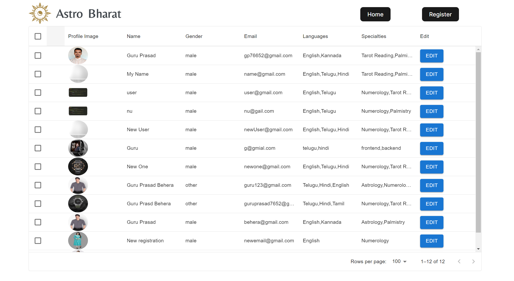
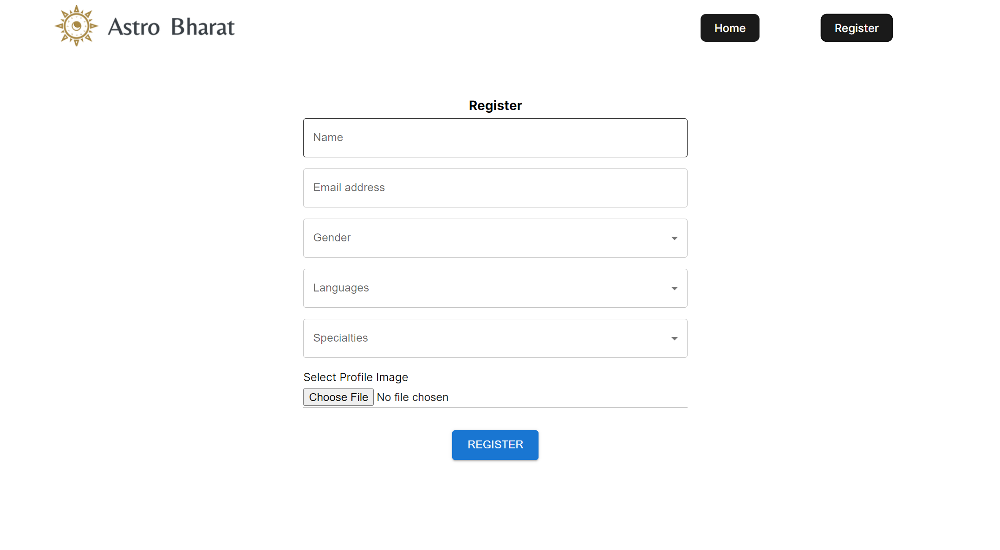
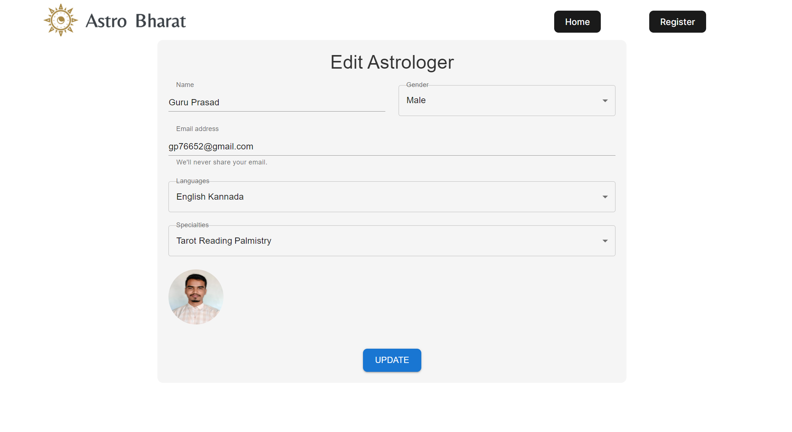

# Astro Bharat

## Introduction

This assignment aims to create a comprehensive Full Stack application focusing on managing astrologer profiles. The backend, developed with Node.js and MongoDB, provides RESTful APIs for registering, listing, and editing astrologer data. On the frontend, a React-based interface, enhanced with Redux Toolkit and RTK Query for state management and API interactions, offers an intuitive admin panel with features like data listing, registration, and editing. By leveraging TypeScript, Material UI, and optional bonus features like form validation and React Router navigation, the project ensures robust functionality, usability, and code quality throughout the development process.

## Project Type

Fullstack

## Deplolyed App

Frontend: https://astrobharatgp.netlify.app/

Backend: https://project-w3wa.onrender.com/

Database: MongoDB

<!-- 
## Features
- Astrologer Can Register
- Astrologer can Edit Data -->


## Installation & Getting started

1. Clone the Project

```
  git clone https://github.com/Guruprasad3n/Astro-Bharat--Assignment.git
```

### Frontend

1. Navigate to the web directory:

   ```
   cd client
   ```

2. Install dependencies:

   ```
   npm install
   ```

3. Start Server

   ```
   npm run dev
   ```

   Frontend Server Started in http://localhost:5173/

### Backend

1. Navigate to the web directory:

   ```
   cd serverTS
   ```

2. Create a .env file in the root directory and add the following environment variables:

   ```
   PORT=8000
   MONGO_URI=mongodb://your_mongodb_url
   ```

3. Install dependencies:

   ```
   npm install
   ```

4. Start Server

   ```
   npm run build
   npm run dev
   ```

   Backend Server Started in http://localhost:8000/

## API Endpoints

GET /api/astrologers - List All Astrologers

POST /api/astrologers/register - Register Astrologer

PUT /api/astrologers/:id - Edit Astrologer Data

## Technology Stack

List and provide a brief overview of the technologies used in the project.

- React.js
  - Redux Toolkit
  - RTK Queries
  - react-router-dom
  - Material UI
  - react-hot-toast
- Node.js
  - cors
  - dotenv
- Express.js
- MongoDB
- Type Script




